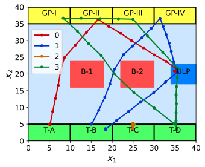

# Task Allocation for Stochastic Multi-Agent Systems (TASMAS) under STL Specifications

**Author:** *Zengjie Zhang* (z.zhang3@tue.nl)

This project demonstrates the risk-aware allocation of real-time STL specifications for stochastic multi-agent systems, with restricted risk probabilities. 

## Introduction

A complicated practical task usually requires the cooperation among multiple agents, which can be formulated as a multi-agent system (MAS) control problem. Formal language such as signal temporal logic (STL) specifications can be used to facilitate correctness or safety guarantees. 

In many practical applications, the MAS is usually required to accomplish dynamically assign tasks during runtime. This requires the MAS to dynamically adjust the global cooperation protocol, namely to which agent a new task should be assigned. From the local perspective, the agent should reschedule its control strategy to accomplish the new task in the lowest possible risk. 

### Scenario

Let us consider a multi-bus routing scenario in a tourism attraction point, as illustrated in **Figure 1**, where four bus terminals denoted as **T-X**, where **X**$\in \{A, B, C, D\}$, four tourist gathering points denoted as **GP-Z**, where **Z**$\in \{I, II, III, IV\}$, and a single unloading point denoted as **ULP** (see the following Figure). Four buses, $A$ to $D$, are tasked with picking up tourists from the gathering points and transporting them to the unloading point. These buses initiate operations from their respective terminals and are expected to return when required. All buses are confined within the attraction point symbolized as ‘**BOX**’. The buses must avoid running into two buildings denoted as **B-Y**, with **Y**$\in \{1, 2\}$. When the tourists at a gathering point reach a certain number, a bus should be available to transport them to the unloading point within a tolerable time limit. Therefore, this study needs to handle dynamically allocated routing tasks, implying that new routing tasks may be assigned at any time $k \in \{0, 1,· · · , N − 1\}$.

[](CASE)

**Figure 1. A multi-bus routing scenario with dynamically assigned tasks.**

### Approach

In a risk-aware control framework, we formulate the physical model of each agent as a linear dynamic system with random dynamic noise and use a set of STL to describe the tasks. In this sense, risk is quantified by the probability that a certain STL task is not satisfied. The risk also serves as an evidence to support the decision-making of the robot whether it has the capability to accept a new task. Based on the risk measures of all agents, an auction-based task assignment algorithm dynamically assigns a new task to the agent that promises the least accomplishing risk. Then, this agent performs control synthesis using a tube-based shrinking-horizon model predictive control method. Please refer to our associated ArXiv article in [https://arxiv.org/abs/2404.02111](https://arxiv.org/abs/2404.02111) for the theoretical details. This paper has been accepted by 2024 Conference on Decision and Control to be held in Milan, Italy, in December 16-19, 2024.

### Relation with Existing Toolbox

The `probstlpy` library in this project is modified from the [stlpy](https://github.com/vincekurtz/stlpy/blob/main/README.md) toolbox. 


## Installation

### System Requirements

**Operating system**
 - *Windows* (compatible in general, succeed on 11)
 - *Linux* (compatible in general, succeed on 20.04)
 - *MacOS* (compatible in general, succeed on 13.4.1)

**Python Environment**
 - Python version: test passed on `python=3.11`
 - Required Packages: 
    - `matplotlib==3.9.0`
    - `numpy==1.26.4`
    - `scipy==1.14.0`
    - `treelib==1.7.0`
    - `control==0.10.0` (see [Documentation](https://python-control.readthedocs.io/en/latest/intro.html))
    - `gurobipy==11.0.2` (**license** required, see [How to Get a Gurobi License](https://www.gurobi.com/solutions/licensing/))

 
### Quick Guide
 
1. Install Python environment;
    ```
    pip install .
    ```

2. Activate the `gurobi` license (See [How To](https://www.gurobi.com/documentation/current/remoteservices/licensing.html)). Note that this project is compatible with `gurobi` Released version `11.0.1`. Keep your `gurobi` updated in case of incompatibility. 

3. Running Instructions
    - Run the main script `example/main.py`;
    - Watch the terminal for runtime information;
    - The figures will show up at the end of running; They are also automatically saved in the root directory;
    - The figures may impede each other; Drag the figures for a better view;
    - Check out the logging file `INFO.log` for the runtime information.

### Fine-Tuning the Code

Feel free to try out the code with different parameter settings in the `src/utils/config.py` file.

- Change the coordinates of the regions in this file to construct a different map;
- Change the standard deviation variable `Sigma` for different noise levels;
- Change the initial position of the robot in `x0`;
- Customize the lists of runtime specifications `specs` and their instants in `times` for various tasks.

## License

This project is with a BSD-3 license, refer to `LICENSE` for details.
